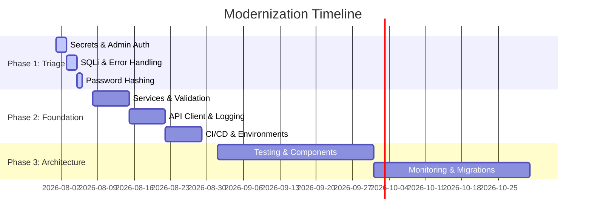

# Phased Migration Plan: Zero-Downtime Codebase Modernization

**Objective:** Transform the legacy Lead Management System into a secure, maintainable, and scalable platform without disrupting service for existing customers.

**Constraint:** The system serves real customers and cannot experience significant downtime. A "big-bang" rewrite is unacceptable. We will utilize the Strangler Fig pattern to progressively modernize the application.

---

## Phase 1: Emergency Triage (Week 1)
**Goal:** Stop the bleeding. Secure the application against immediate critical threats without changing the underlying architecture.

| Day | Task | What Ships | Risk Level | Rollback Strategy | Verification |
| :--- | :--- | :--- | :--- | :--- | :--- |
| **1** | **Secrets Management** | Move hardcoded secrets from `config.js` to `.env`. Add `.env` to `.gitignore`. Rotate production Stripe, DB, and JWT keys. | High | Revert commit, but keys *must* stay rotated. Keep old keys active for 1 hr overlap if possible. | Verify app boots locally and in prod with new env vars. Attempt to read old keys; should fail. |
| **2** | **Admin Endpoint Protection** | Implement and apply `requireAuth` and `requireAdmin` middleware to all PUT/DELETE admin endpoints. | Medium | Remove middleware from routes. | Test endpoints with unauthenticated requests (expect 401), basic user (expect 403), and admin (expect 200). |
| **3** | **SQL Injection Remediation** | Replace string-concatenated SQL with parameterized queries across all database calls. | High (Syntax errors) | Revert to previous commit. | Manual testing of all forms. Attempt basic SQL injection payloads (e.g., `' OR 1=1 --`); ensure they are treated as literal strings. |
| **4** | **Basic Error Handling** | Add Express global error middleware. Add `process.on` handlers for uncaught exceptions/rejections. | Low | Revert commit. | Intentionally throw an error in a dev endpoint; verify it returns a structured 500 JSON response instead of crashing the server. |
| **5** | **Password Hashing** | Implement `bcrypt`. Create a middleware to detect plain-text passwords on login, hash them, and update the DB transparently upon next successful login. | High (Lockouts) | Revert auth logic changes. Keep plain-text column temporarily. | Create new user; verify hash in DB. Login with old plain-text user; verify DB updates to hash seamlessly. |

---

## Phase 2: Foundation (Month 1)
**Goal:** Establish clean architecture principles, improve developer experience, and prepare for safe scaling.

### Week 2: Architectural Separation & Validation
*   **Action:** Extract business logic from Express route handlers into a dedicated Service layer. Implement input validation (e.g., Zod) on all routes.
*   **Dependencies:** Phase 1 complete.
*   **Bandwidth:** 2 Backend Engineers.
*   **Risks:** Breaking existing functionality during extraction.
*   **Mitigation:** Do this route-by-route. Write a high-level integration test for a route *before* refactoring it to ensure the contract remains identical.
*   **Success Criteria:** Controllers are < 30 lines. All endpoints validate `req.body` and `req.query` before processing.

### Week 3: Frontend Decoupling & Observability
*   **Action:** Remove direct DB connection strings from the React frontend. Create necessary backend API endpoints. Update React to use an API client (Axios/Fetch). Replace `console.log` with a structured logger (Pino/Winston).
*   **Dependencies:** Backend API endpoints must be ready before frontend switch.
*   **Bandwidth:** 1 Frontend, 1 Backend Engineer.
*   **Risks:** Temporary mismatch between frontend expectations and backend API.
*   **Mitigation:** Deploy backend API updates first, silently alongside old DB access. Then deploy frontend update to switch over.
*   **Success Criteria:** Frontend bundle contains no DB credentials. Logs output in structured JSON format.

### Week 4: Automation & Environments
*   **Action:** Setup CI/CD pipeline (GitHub Actions). Enforce basic test execution on PRs. Establish separate Dev, Staging, and Prod environments with distinct databases.
*   **Dependencies:** Codebase must be runnable via scripts (`npm start`, `npm test`).
*   **Bandwidth:** 1 DevOps/Backend Engineer.
*   **Risks:** Deployment pipeline failures causing release delays.
*   **Mitigation:** Run the new pipeline in parallel with the manual deployment process until proven stable.
*   **Success Criteria:** Every PR runs tests. Commits to `main` deploy automatically to Staging.

---

## Phase 3: Architecture & Scale (Quarter 1)
**Goal:** Pay down remaining technical debt, solidify reliability, and optimize performance.

### Month 2: Testing & Component Decomposition
*   **Action:** Expand test suite targeting 70% coverage on critical paths. Break down the monolithic 1200-line `App.jsx` into smaller, domain-specific components. Implement API versioning (e.g., `/api/v1/`).
*   **Dependencies:** CI/CD pipeline active.
*   **Bandwidth:** Full Team.
*   **Risks:** Frontend regressions during component split.
*   **Mitigation:** Utilize feature flags for major UI structural changes. Rely on Cypress/Playwright for critical frontend flows.
*   **Success Criteria:** Coverage reports indicate >70%. `App.jsx` is primarily a routing/provider wrapper.

### Month 3: Hardening & Monitoring
*   **Action:** Implement a formal database migration system (e.g., Knex migrations). Integrate Application Performance Monitoring (APM) (e.g., Datadog, New Relic) and set up alerting for error rate spikes. Conduct an external security audit.
*   **Dependencies:** Structured logging active.
*   **Bandwidth:** 1 Lead Engineer + External Security Firm.
*   **Risks:** Migration system misconfiguration causing schema drift.
*   **Mitigation:** Test all down-migrations thoroughly on staging database copies.
*   **Success Criteria:** All schema changes are tracked in version control. Alerts fire in Slack when error rates exceed 1%. Security audit yields no Critical/High findings.

---

## Visual Timeline

